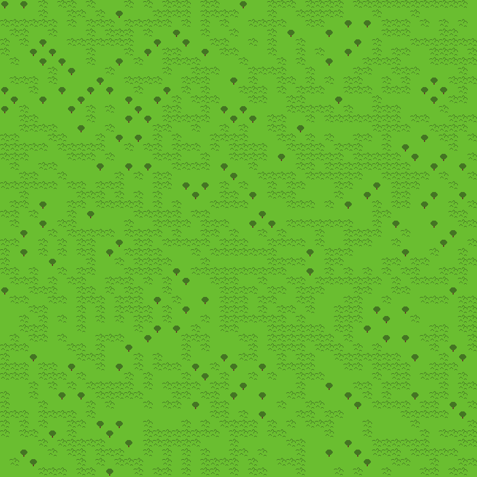
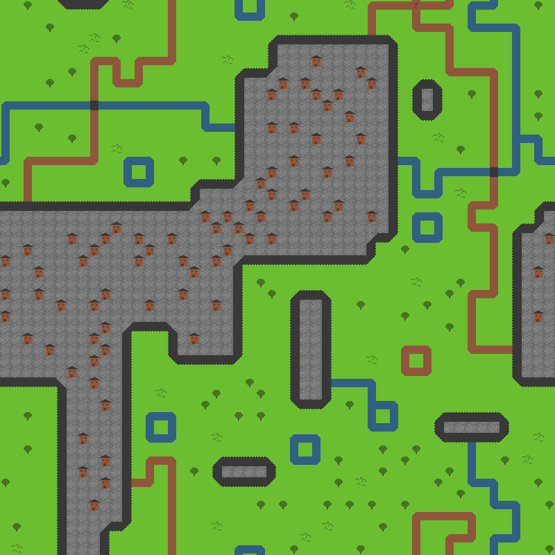

# Tilegen

A CLI program to generate tilemaps using
[WaveFunctionCollapse](https://github.com/mxgmn/WaveFunctionCollapse) via a modified version of the
[wfc](https://crates.io/crates/wfc) crate.

```
tilegen 0.3.0

USAGE:
	tilegen <input-config> <SUBCOMMAND>

FLAGS:
	-h, --help       Prints help information
	-V, --version    Prints version information

ARGS:
	<input-config>    The input configuration file.

SUBCOMMANDS:
	generate-image      Generate a tilemap, convert it into an image and save it to a file
	generate-tilemap    Generate a tilemap and save it to a file
	help                Prints this message or the help of the given subcommand(s)
	tilemap-to-image    Render a generated tilemap to an image
```

`tilegen` takes a [Rust Object Notation](https://github.com/ron-rs/ron) configuration file as input.
This file sets up the rendering infomation and neighbour rules between tiles. Here's what
[examples/simple.ron](examples/simple.ron) looks like:

```rust
(
	// The relative path of the tileset image that this config uses.
	tileset_image_path: "rivers_and_roads.png",
	// The size of an tile in the tileset. Here it's 16 pixels by 16 pixels.
	tile_size: 16,
	// A map of tile ID strings to their configurations.
	tiles: {
		"grass": (
			// The relative likelyhood of this tile appearing. All tiles in this example have a
			// 'weight' of 1, meaning that they're equally as likely to occur as each other.
			weight: 1,
			// The location of the tile in the tileset, from the top-left.
			coords: (0, 0),
			allowed_neighbours: {
				// Here we say that this grass tile is allowed to neighbour with grass tiles in all
				// directions. `All` is just a short way of writing the same thing out for `Up`,
				// `Right`, `Down`, and `Left`.
				All: [(label: "grass")],
			},
		),
		"tree": (
			weight: 1,
			coords: (1, 2),
			allowed_neighbours: {
				// This tree tile can neighbour with grass tiles, but not other tree tiles. Note
				// that this commutatively applies the same rule to the grass tile.
				All: [(label: "grass")]
			}
		),
		"hills": (
			weight: 1,
			coords: (5, 1),
			allowed_neighbours: {
				// This hill tile can neighbour with grass tiles and other hill tiles.
				All: [(label: "grass"), (label: "hills")]
			}
		),
	},
)
```

Run with:
```
cargo run --release -- examples/simple.ron generate-image simple_generated.png
```

You should end up with something like this:



A more complex example can be found in [examples/rivers_and_roads.ron](examples/rivers_and_roads.ron):


